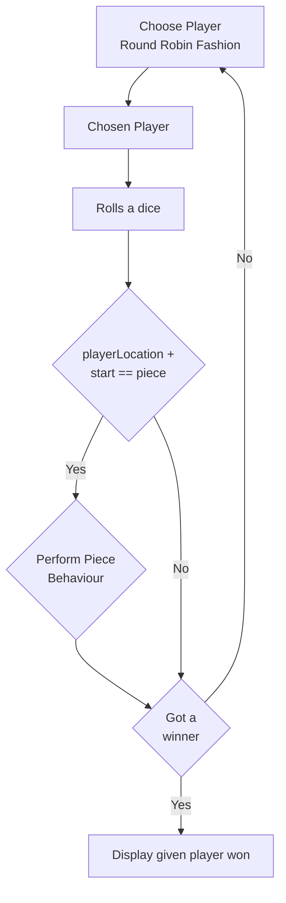

```mermaid
flowchart TB

    ChoosePlayer[Choose Player<br>Round Robin Fashion]

    P[Chosen Player]

    DiceRoll[Rolls a dice]

    DecisionIfLandedOnPiece{playerLocation + <br>start == piece}

    PieceBehaviour{Perform Piece<br>Behaviour}

    GotWinner{Got a<br>winner}

    GameEnd[Display given player won]

    ChoosePlayer --> P

    P --> DiceRoll

    DiceRoll --> DecisionIfLandedOnPiece

    DecisionIfLandedOnPiece -- Yes --> PieceBehaviour

    PieceBehaviour --> GotWinner

    GotWinner -- Yes --> GameEnd

    GotWinner -- No --> ChoosePlayer

    DecisionIfLandedOnPiece -- No --> GotWinner
```

